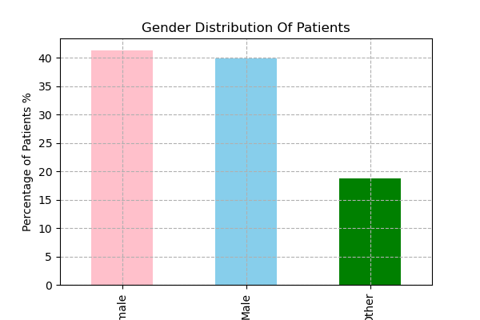
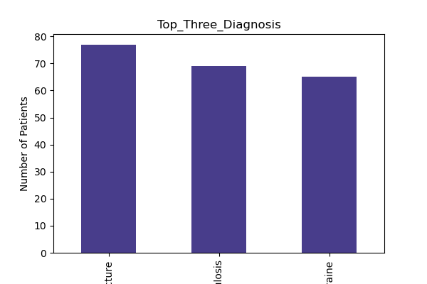

# 🏥 Healthcare Data Analysis Using Python (Pandas)

This project explores a synthetic healthcare dataset containing patient records to uncover insights using **Pandas**. The dataset contains 500+ patient entries with various attributes such as age, gender, department, diagnosis, treatment cost, and outcomes.

---

## 📊 Business Questions & Insights

### 1. What is the Average Age of Patients?
```python
health_data['Age'].mean()
📌 Insight: The average age of patients is 51.66 years.

```
### 2. What is the Gender Distribution of Patients?
```python

health_data['Gender'].value_counts(normalize=True) * 100

📌 Insight:

* Female: 41.63%

* Male: 39.63%

* Other: 18.73%

Majority of patients are female.
```



### 3. Top 5 Cities with the Highest Number of Patients
```python
health_data['City'].value_counts().head(5)
📌 Insight:
Lake David, Smithshire, East Christopher, Christopherville, and Brownburgh lead in patient count.
```


### 4. Number of Patients Admitted per Department
```
health_data['Department'].value_counts()
📌 Insight:
Most admissions were in Pediatrics, followed by Gastroenterology and Neurology.
```


### 5. Average Length of Stay per Department
```health_data.groupby('Department')['Length_of_Stay'].mean()
📌 Insight:
Stays range from 14 to 17 days across departments, with Gastroenterology having the highest average.
```
### 6. What is the Overall Average Treatment Cost?
```
health_data['Treatment_Cost'].mean()
📌 Insight:
The overall average treatment cost is $ 10,359.
```
### 7. Average Treatment Cost by Department
```
health_data.groupby('Department')['Treatment_Cost'].mean()
📌 Insight:

Highest: Oncology ($11,042)

Lowest: Cardiology ($9,781)
```
### 8. Top 3 Most Common Diagnoses
```
health_data['Diagnosis'].value_counts().head(3)
📌 Insight:

* Fracture
* Tuberculosis
* Migraine
```


### 9. Readmission Rate Within 30 Days
```health_data['Readmission_Within_30_Days'].value_counts(normalize=True) * 100
📌 Insight:
Approximately 17.46% of patients were readmitted within 30 days.
```


### 10. Department with Highest Avg. Treatment Cost
```health_data.groupby('Department')['Treatment_Cost'].mean().idxmax()
📌 Insight:
Oncology has the highest average treatment cost.
```
### 11. Correlation Between Age and Treatment Cost
```
health_data['Age'].corr(health_data['Treatment_Cost'])
📌 Insight:
Weak negative correlation (-0.041) – age doesn't significantly affect cost.
```
### 12. Distribution of Payment Methods
```
health_data['Payment_Method'].value_counts()
📌 Insight:

Insurance: 161

Medicare: 141

Credit Card: 124

Cash: 118
```


### 13. City with Highest Avg. Treatment Cost
```
health_data.groupby('City')['Treatment_Cost'].mean().idxmax()
📌 Insight:
Kevinberg has the highest average treatment cost.
```
### 14. Avg. Length of Stay by Diagnosis
```
health_data.groupby('Diagnosis')['Length_of_Stay'].mean()
📌 Insight:

Longest: Arthritis, Fracture (18 days)

Shortest: Migraine (12 days)
```
#### 15. Do Older Patients (60+) Have Higher Readmission Rates?

# Compare readmission for age >60 and <60
📌 Insight:

60 years: 13.9%

<60 years: 20.2%

Surprisingly, younger patients had higher readmission rates.

#### 16. Department-wise Mortality Rate Analysis

# Deceased count / total per department
📌 Insight:

Highest mortality: Orthopedics (44.77%)

Lowest mortality: Gastroenterology (25.88%)
